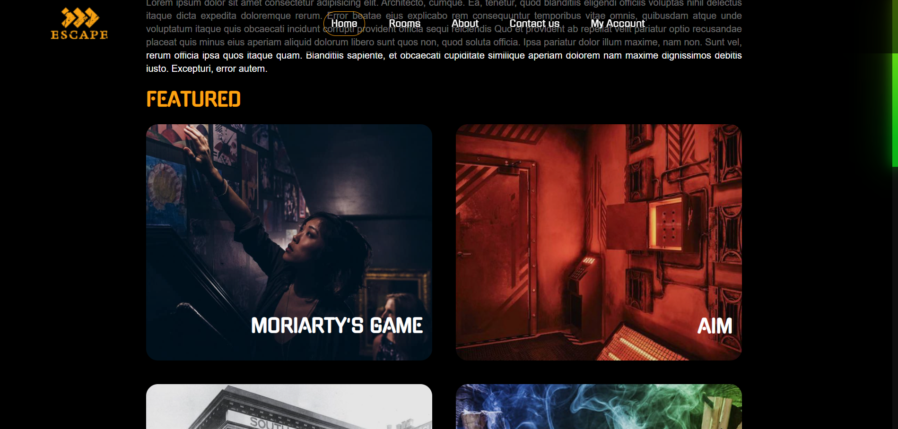
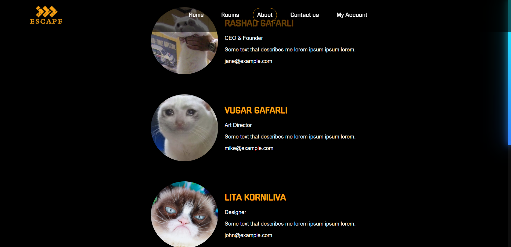
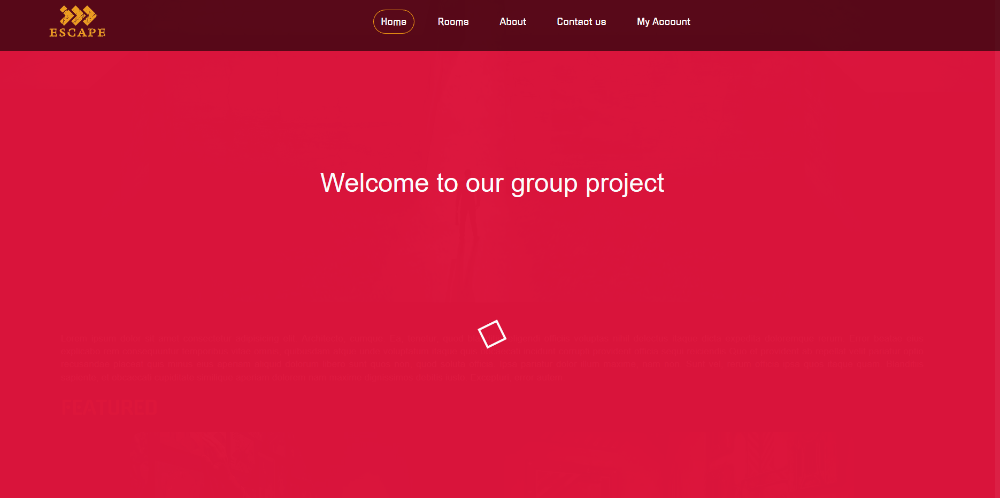
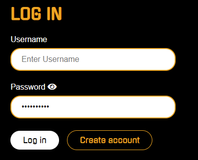
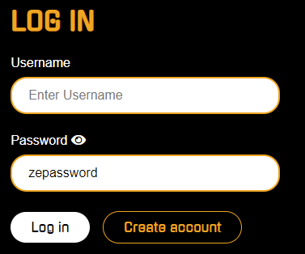

# Escape

## Room planning and check tool for restrictions and room suitability Coursework Project of Taltech

## Setup 

The project has been made by using Front-End technologies, such as HTML, CSS and JS, Twig templating language, the backend server-side language PHP, and MySQL database language. <br>
The final website is available on _Enos :_

- https://enos.itcollege.ee/~vugafa/EscapeRoom/  //editing maybe required
- https://enos.itcollege.ee/~ragafa/EscapeRoom/  //editing maybe required
- https://enos.itcollege.ee/~likorn/EscapeRoom/  //editing maybe required <br>

### The Detailed Explanation is divided into Front/Back-End Part below

# *Front-End Explanation* 

## *Location*

- / templates

All the html templates are in this directory with Twig extension added. <br>

- / pictures

Images used for the project are located under this directory. <br>

- / styles

CSS file is under the styles directory with the style.css. <br>

## *Notable UI features and elements*

In the index.html and contact-us.html, Google Maps API was used to show the map of the "EscapeRoomProject". The following CSS and HTML codes have been used to achieve the result:

```
// HTML code

<iframe class="map-canvas"
        src="https://maps.google.com/maps?q=2880%20Broadway,%20New%20York&t=&z=13&ie=UTF8&iwloc=&output=embed"
></iframe>

```

The gradient scroll has been achieved with the help of the following codes:





```
// HTML

<div id="progressbar"></div>
<div id="scrollPath"></div>

// JS code

let progress = document.getElementById('progressbar');
let totalHeight = document.body.scrollHeight - window.innerHeight;

window.onscroll= function(){
    let progressHeight = (window.pageYOffset / totalHeight) * 100;
    progress.style.height = progressHeight + "%";
}

```

The welcoming loader in the index.html has been achieved with the help of the following codes:



```

// HTML

<div class="loader-wrapper">
<p class="welcome">Welcome to our group project</p>
<span class="loader"><span class="loader-inner"></span></span>
</div>

// CSS code

.loader-wrapper {
    height: 100%;
    width: 100%;
    text-align: center;
    position: absolute;
    top: 0;
    left: 0;
    background-color: crimson;
}

.loader {
    display: inline-block;
    text-align: center;
    width: 30px;
    height: 30px;
    position: relative;
    border: 4px solid #fff;
    top: 25%;
    animation: loader 3s infinite ease;
}

.welcome {
    font-size: 45px;
    position: relative;
    top: 15%;
    text-align: center;
}

.loader-inner {
    vertical-align: top;
    display: inline-block;
    width: 100%;
    background-color: #fff;
    animation: loader-inner 3s infinite ease-in;
}

@keyframes loader {
    0% {
        transform: rotate(0deg);
    }
    25% {
        transform: rotate(180deg);
    }
    50% {
        transform: rotate(180deg);
    }
    75% {
        transform: rotate(360deg);
    }
    100% {
        transform: rotate(360deg);
    }
}

@keyframes loader-inner {
    0% {
        height: 0%;
    }
    25% {
        height: 0%;
    }
    50% {
        height: 100%;
    }
    75% {
        height: 100%;
    }
    100% {
        height: 0%;
    }
}

// JS code

$(window).load(function() { 
    $(".loader-wrapper").fadeOut(1500); 
    });

```


The password show/hide feature has been achieved with the help of the following codes:




```
// JS code

var isRevealed = false;
function showPwd() {
    if (isRevealed == false) {
        document.getElementById("password").type = 'text';
        isRevealed = true;
    } else {
        document.getElementById("password").type = 'password';
        isRevealed = false;
    }
}

```

# *Back-End Explanation*

The backend related files are located in the /src directory. Each file there represents a web page. 
The /src contains also two sub-directories:
- /src/db which is responsible for database related operations. 
- /src/model which consist of 5 classes which represent domain models.

The structure of the /src directory:

```
src
├── db
│   ├── dbconnection_data.php
│   ├── reservation-manager.php
│   ├── room-manager.php
│   └── user-manager.php
└── model
    ├── about.php
    ├── book.php
    ├── contact-us.php
    ├── login.php
    ├── myaccount.php
    ├── rooms.php
    ├── session-manager.php
    ├── signip.php
    └── utils.php
```
## *Security Features*

### *Sanitizing Input*

In order to prevent simple javascript injection, function postSanitized() is used.

This will remove tags character such as '<', '>', '&', ';' and other operators that allow excution of javascript. It still allows certain tags like ```<b> <i>``` so it is still not entirely secure yet. 

```
function cleanInput(?string $data): string
{
    $data = trim($data);
    $data = stripslashes($data);
    $data = htmlspecialchars($data);
    return $data;
}

function postSanitized(): array
{
    foreach ($_POST as $key => $value) {
        $_POST[$key] = cleanInput($value);
    }
    return $_POST;
}
```

### Session Control ###

Since cookie can be modified and is dangerous. We don't use cookie to validate any form. Instead, session is used.

### Team Members ###

- Vugar Gafarli  | vugafa | vugafa@ttu.ee | 194478IVSB
- Rashad Gafarli | ragafa | ragafa@ttu.ee | 201815IVSB
- Lita Kornilova | likorn | likorn@ttu.ee | 195076IVSB
